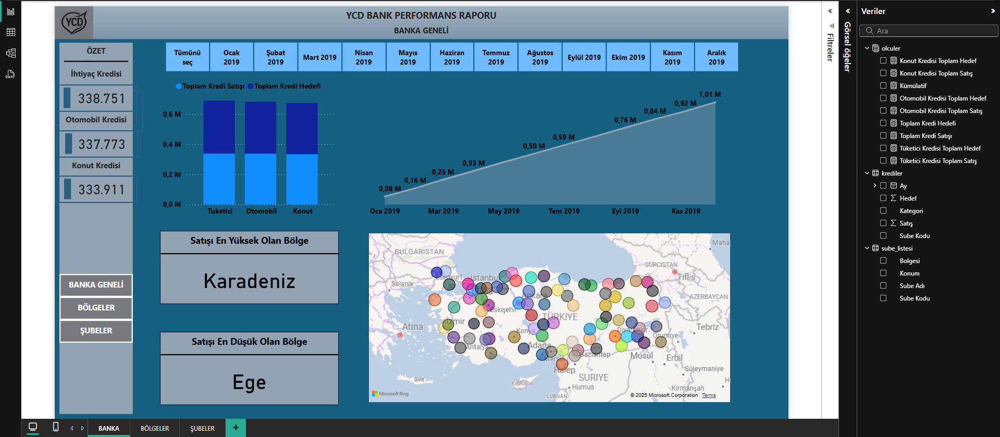
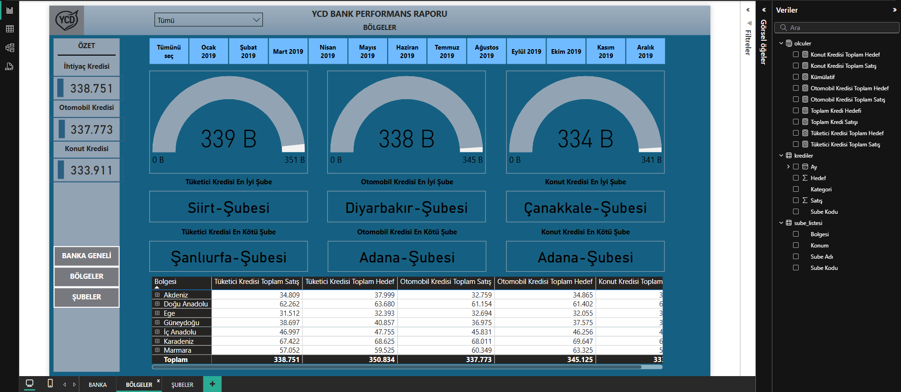
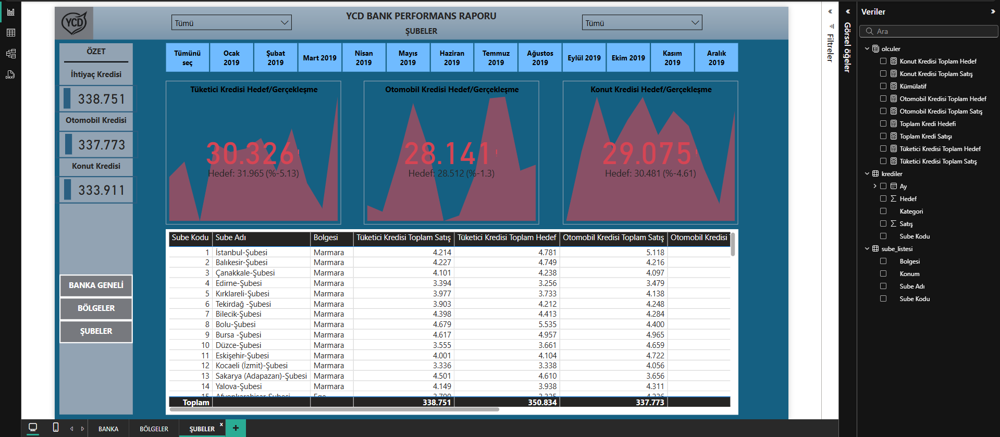

# 🏦 Banka Performans Raporu - Power BI Dashboard

Bu Power BI raporu, Türkiye genelindeki banka şubelerinin kredi satış performansını analiz etmek amacıyla geliştirilmiştir. Dashboard; **banka geneli**, **bölge bazında** ve **şube bazında** olmak üzere üç farklı analiz düzeyi sunar.

## 🎯 Proje Amacı

- Şube ve bölge bazlı satış performanslarını izlemek
- Gerçekleşen satışları hedeflerle karşılaştırmak
- En iyi ve en düşük performanslı şubeleri tespit etmek
- Stratejik kararlar için üst yönetime görsel destek sağlamak

## 📁 Veri Kaynakları

### 🔹 `krediler.xlsx`

Bu dosya, her şubenin aylık kredi satış verilerini ve hedeflerini içerir.

| Sube Kodu | Kategori | Ay      | Satış | Hedef |
| --------- | -------- | ------- | ----- | ----- |
| 1         | Tuketici | Ocak 19 | 564   | 491   |
| ...       | ...      | ...     | ...   | ...   |

> **Kategoriler:** Tüketici, Otomobil, Konut Kredileri  
> **Ay:** Ocak 2019 – Aralık 2019  
> **KPI:** Satış, Hedef, Gerçekleşme Oranı

### 🔹 `sube_listesi.xlsx`

Şubelerin isimleri, bölgeleri ve konum bilgilerini içerir.

| Sube Kodu | Sube Adı              | Bölgesi | Konum          |
| --------- | --------------------- | ------- | -------------- |
| 1         | İstanbul-Şubesi       | Marmara | İstanbul       |
| 15        | Afyonkarahisar-Şubesi | Ege     | Afyonkarahisar |

> Bu tablo, `krediler.xlsx` ile **Sube Kodu** üzerinden ilişkilendirilmiştir. Power BI içindeki modelde “bir-çoğa” ilişkisi kurulmuştur.

## 📊 Veri Modeli

## 📊 Dashboard Sayfaları

### 1️⃣ **Banka Geneli**

- Türkiye geneli toplam kredi satış ve hedefleri
- Yıllık aylık satış trendleri
- Kredi türlerine göre satış/hacim analizi
- En yüksek ve en düşük satış yapan bölgeler

### 2️⃣ **Bölgeler**

- Bölge bazında satış ve hedef karşılaştırmaları
- Tüketici, Otomobil ve Konut kredileri ayrı ayrı analiz edilir
- En iyi / en kötü şubeler bölge bazında görüntülenir
- Dinamik filtre: **Bölge seçimi yapılabilir**

### 3️⃣ **Şubeler**

- Tüm şubelerin satış ve hedef verileri tablo halinde sunulur
- KPI’lar: Gerçekleşme oranları (%), hedef-satış farkı
- Hem bölge hem şube seçimi ile filtreleme imkanı

## 📌 Kullanıcı Etkileşimi

- 📆 **Tarih Dilimi:** Aylık bazda filtreleme (Ocak – Aralık 2019)
- 📍 **Bölge ve Şube Seçimi:** Bölgelere göre şube detayları filtrelenebilir
- 💳 **Kredi Türü:** Her sayfada 3 farklı kredi türü arasında ayrım yapılır

## 💼 Hedef Kullanıcılar

Bu rapor, banka yönetimi, bölge müdürleri ve iş analistlerinin kullanımına yöneliktir. Performans analizi ile birlikte hedeflerden sapmaların nedenleri analiz edilerek hızlı karar alma süreçleri desteklenir.
