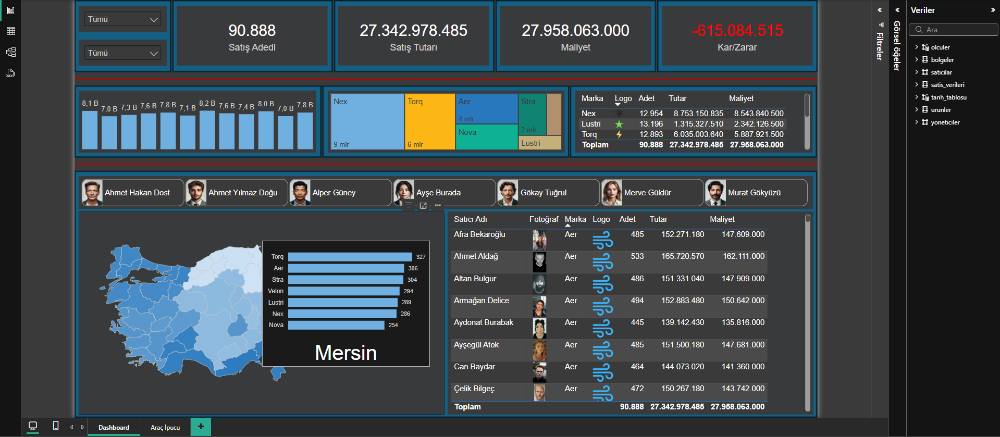

# 🧠 Satış Analizi – Power BI Dashboard

## 📊 Proje Hakkında

Bu Power BI projesi, Türkiye’de farklı bölgelerde gerçekleştirilen satışların **detaylı analizini** sunar. Dashboard, marka performansı, satış temsilcilerinin başarıları, kârlılık durumu ve bölge bazlı satış hacimleri gibi kritik metrikleri görselleştirerek karar vericilere içgörü sağlar.

## 🎯 Hedefler

- Satış temsilcilerinin performansını karşılaştırmak
- Bölge, marka ve şehir bazlı satış analizleri yapmak
- Kârlılık (kâr/zarar) durumunu izlemek
- Ürünlerin maliyet / fiyat oranlarını değerlendirmek

## 📁 Veri Seti

| Tablo Adı        | Açıklama                                                                  |
| ---------------- | ------------------------------------------------------------------------- |
| `satis_verileri` | Günlük satış detaylarını içerir (tarih, ürün, satış merkezi, maliyet vs.) |
| `saticilar`      | Satış temsilcilerine ait bilgiler (isim, bölge, profil fotoğrafı)         |
| `urunler`        | Ürün markaları ve logoları                                                |
| `yoneticiler`    | Bölge yöneticilerine ait bilgiler                                         |
| `bolgeler`       | Türkiye’nin bölgeleri ve illeri                                           |

Veri kaynağı: **`Bolge Satis Dashboard Raw.xlsx`**

## 🔧 Veri Modeli

Veri modeli **yıldız şema (star schema)** mantığında kurulmuştur. Merkezde `satis_verileri` tablosu yer alırken diğer tablolar boyutsal (dimension) rolündedir.

## 📌 Dashboard Özellikleri

### 1. Genel Satış KPI’ları

- **Toplam Satış Adedi**
- **Toplam Satış Tutarı**
- **Toplam Maliyet**
- **Kâr / Zarar**

### 2. Marka Performansı

- Markalara göre satış adedi & tutarı
- Karşılaştırmalı maliyet analizleri

### 3. Bölge & İl Bazlı Analiz

- Türkiye haritası üzerinde il bazlı satış yoğunluğu
- İl seçimine göre detaylı marka performansı
- Örnek: (Adana detayı)

### 4. Satıcı Performansları

- Satış temsilcilerinin satış adedi, tutarı ve maliyet analizi
- Profil görselleriyle zenginleştirilmiş tablo

### 5. Zaman Serisi Analizi

- Aylık satış trendi (yıllar arası karşılaştırmalı sütun grafik)

## 📦 Kullanılan Teknolojiler

- **Power BI Desktop**
- **Excel (veri kaynağı)**
- **Power Query & DAX**
- **Relational Data Modeling**

## 💡 Kazanımlar

- Dinamik filtrelemeler ile **kullanıcı dostu arayüz** geliştirme
- İlişkili veri modelleri kurarak **çok boyutlu analiz** yapma
- KPI takibi ve performans ölçümü için canlı raporlar üretme
- Power Query ile etkin veri temizliği & dönüştürme

_Prepared by **Yaşar Can Damlı** – for Business/Data/BI Analyst portfolio showcase._
